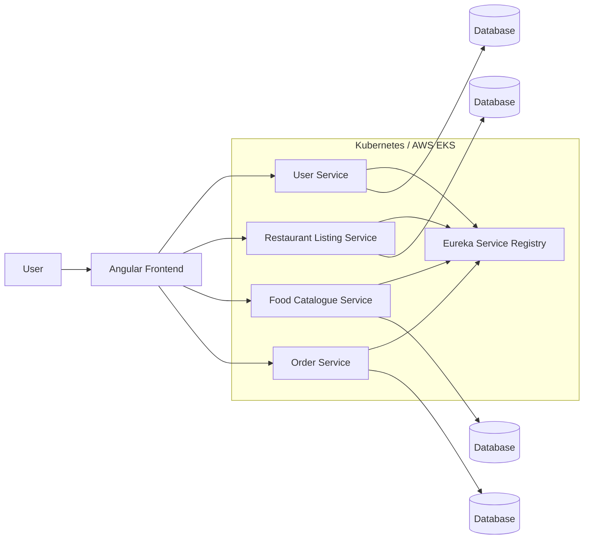

# Cloud-Based Food Ordering Platform

A **microservices-based food ordering platform** built with **Angular, Java Spring Boot, Docker, Kubernetes, and AWS**. The application separates user management, restaurant discovery, food catalog, and order processing into independently deployable backend services connected through RESTful APIs.

This project demonstrates the design and deployment of a distributed application using **service discovery, containerization, Kubernetes orchestration, CI/CD, and cloud infrastructure**.

## Architecture



## Features

* Browse available restaurants and retrieve restaurant information
* View restaurant menus and food catalog data
* Manage user-related operations
* Place and process customer orders
* Communicate between frontend and backend services through RESTful APIs
* Register and discover microservices through **Netflix Eureka**
* Containerize backend services using **Docker**
* Deploy services to **AWS Elastic Kubernetes Service (EKS)**
* Use Kubernetes deployments and services for application orchestration
* Support automated build and deployment through a **CI/CD pipeline**

## Technology Stack

### Frontend

* Angular
* TypeScript
* HTML
* CSS
* REST API integration

### Backend

* Java
* Spring Boot
* Spring REST
* Spring Data
* Maven
* Netflix Eureka

### DevOps & Cloud

* Docker
* Kubernetes
* AWS EKS
* AWS Load Balancer
* Jenkins
* Argo CD
* Git / GitHub

### Testing

* JUnit
* API testing
* Containerized service validation

## Microservices

The application is divided into multiple services with separate responsibilities.

### User Service

Handles user-related operations and provides user information required by other components of the application.

```text
user-service-master/
```

### Restaurant Listing Service

Provides restaurant information and allows the frontend to retrieve available restaurants.

```text
restaurant-listing-ms-master/
```

### Food Catalogue Service

Manages restaurant food items and menu information.

```text
food-catalogue-MS-master/
```

### Order Service

Handles order creation and coordinates information required to process customer orders.

```text
order-service-master/
```

### Eureka Service

Acts as the **service registry** for the microservices architecture.

Backend services register themselves with Eureka so that services can locate other application components dynamically.

```text
eureka-service-master/
```

### Angular Frontend

Provides the user interface for restaurant browsing, menu selection, and order placement.

```text
food-delivery-app-FE-master/
```

### Deployment Configuration

Contains Kubernetes and deployment-related configuration used to deploy the application.

```text
deployment-folder-master/
```

## Repository Structure

```text
food-delivery-microservices/
│
├── food-delivery-app-FE-master/
│   └── Angular frontend application
│
├── user-service-master/
│   └── User microservice
│
├── restaurant-listing-ms-master/
│   └── Restaurant discovery microservice
│
├── food-catalogue-MS-master/
│   └── Food catalogue microservice
│
├── order-service-master/
│   └── Order processing microservice
│
├── eureka-service-master/
│   └── Eureka service registry
│
├── deployment-folder-master/
│   └── Kubernetes deployment configuration
│
└── Other-resources-main/
    └── Additional project resources
```

## REST API Design

The frontend communicates with backend services through RESTful APIs using JSON request and response models.

Typical workflows include:

```text
Angular Frontend
      |
      | REST API
      v
Restaurant Service
      |
      v
Restaurant Data
```

and:

```text
Angular Frontend
      |
      | Order Request
      v
Order Service
      |
      +----> User Service
      |
      +----> Food Catalogue Service
      |
      v
Order Created
```

The services are designed around clear domain boundaries so they can be developed, deployed, and scaled independently.

## Containerization

Each Spring Boot service can be packaged as a JAR application and built into a Docker image.

Example:

```bash
mvn clean package
docker build -t food-ordering-service .
```

Containers provide a consistent runtime environment across development and cloud deployment.

## Kubernetes Deployment

The containerized services are deployed using Kubernetes.

Kubernetes is responsible for:

* Running application containers inside pods
* Maintaining the desired number of service replicas
* Exposing backend services through Kubernetes Services
* Restarting unhealthy application instances
* Supporting horizontal application scaling
* Managing communication between distributed services

The production architecture is designed for deployment to:

```text
AWS Elastic Kubernetes Service (EKS)
```

## CI/CD

The project uses a CI/CD workflow to automate application delivery.

```text
Developer Push
      |
      v
GitHub
      |
      v
Jenkins
      |
      +----> Build Application
      |
      +----> Run JUnit Tests
      |
      +----> Build Docker Image
      |
      v
Container Registry
      |
      v
Argo CD
      |
      v
Kubernetes / AWS EKS
```

### Jenkins

Jenkins automates:

* Source code checkout
* Maven builds
* Unit testing
* Docker image creation
* Container image publishing

### Argo CD

Argo CD provides GitOps-based Kubernetes deployment and synchronizes deployment configuration with the Kubernetes cluster.

## Local Development

### Prerequisites

Install the following tools before running the project:

```text
Java
Maven
Node.js
Angular CLI
Docker
Kubernetes
Git
```

### Clone the Repository

```bash
git clone https://github.com/Jun-Code-Star/food-delivery-microservices.git
cd food-delivery-microservices
```

### Start Eureka Service

```bash
cd eureka-service-master
mvn spring-boot:run
```

### Start Backend Services

Run each Spring Boot microservice separately.

Example:

```bash
cd restaurant-listing-ms-master
mvn spring-boot:run
```

```bash
cd food-catalogue-MS-master
mvn spring-boot:run
```

```bash
cd user-service-master
mvn spring-boot:run
```

```bash
cd order-service-master
mvn spring-boot:run
```

### Start Angular Frontend

```bash
cd food-delivery-app-FE-master
npm install
ng serve
```

Then open:

```text
http://localhost:4200
```

## Key Engineering Concepts Demonstrated

This project demonstrates practical experience with:

* Microservices architecture
* RESTful API design
* Distributed service communication
* Service discovery
* Java Spring Boot development
* Angular frontend development
* Docker containerization
* Kubernetes orchestration
* AWS EKS deployment
* CI/CD automation
* GitOps deployment with Argo CD
* Unit testing with JUnit
* Cloud-native application architecture

## Future Improvements

Potential enhancements include:

* API Gateway for centralized routing
* JWT-based authentication and authorization
* Centralized configuration management
* Distributed tracing
* Centralized application logging
* Kubernetes Horizontal Pod Autoscaling
* Redis caching
* Message-driven communication using Kafka
* Centralized monitoring with Prometheus and Grafana

## Author

**Jun Zhang**

GitHub: [Jun-Code-Star](https://github.com/Jun-Code-Star)

---

This project was developed as a hands-on implementation of a **cloud-native, distributed food ordering system**, focusing on microservices design, REST API development, containerization, Kubernetes deployment, and CI/CD automation.
